# Desafio 2 - Crie duas máquinas virtuais

**Abra seu Virtual Box para dar inicio a esse passo**

1. Clique no botão **NOVO** ou **NEW** na barra superior do lado direito.
2. Assim que clicar irá surgir um nova janela para nomear a sua máquina virtual, pode nomear como "Oracle Linux"
3. Na Opção **IMAGEM ISO**, selecione a o arquivo ISO que baixou
4. Por último clique em **Próximo**, como na imagem abaixo:

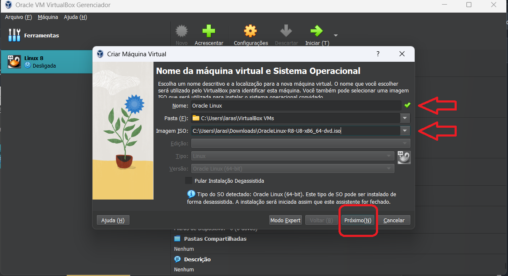

## Configurando a sua máquina virtual

1. Logo depois que clicar em Próximo no último item do passo anterior
2. Coloque um nome de **usuário** e **senha**
3. Na opção **NOME DO SERVIDOR**, coloque um nome simples sem espaços só para identificar o seu servidor, e clique em **Próximo**.

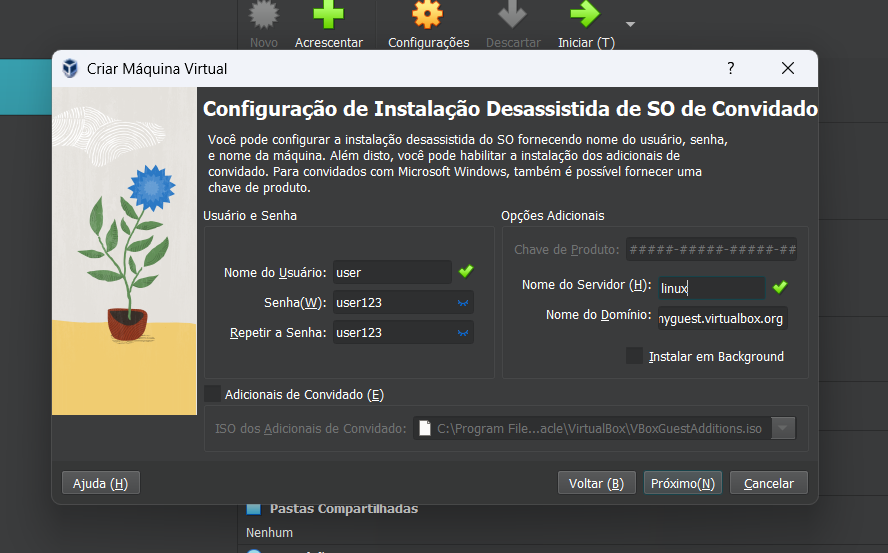

## Hardware

1. Selecione **4096MB**, que equivalem a **4GB**
2. Clique em **Próximo**


### Disco rigido

- Deixe selecionado a opção **CRIAR UM NOVO DISCO RÍGIDO VIRTUAL AGORA**
- No item **TAMANHO DO DISCO**, selecione no mínimo **12GB**
- Clique em **PROXIMO**
- E **FINALIZAR**

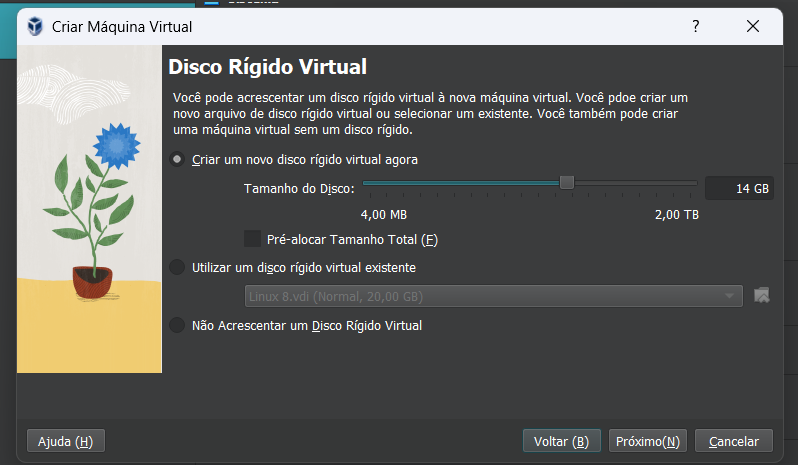

## Adicione o SO na Virtual Machine

1. Selecione a opção **CONFIGURAÇÕES** na barra superior a direita, isso vai abrir um menu de opções.
2. Selecione a opção **ARMAZENAMENTO**, clique no espaço vazio abaixo de **Controladora:IDE**
3. Clique no icone de **CD**, no item **DRIVE OPTICO**, e selecione a Imagem ISO que baixou, no meu caso está salvo como _"OracleLinux-R8-U8-X86_64-dvd.iso"_, em seguida clique em **OK**.

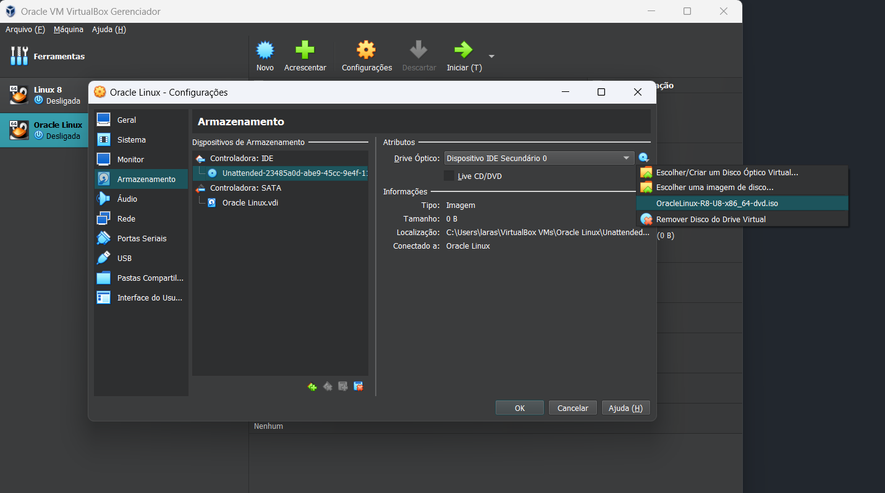

### Instalando o Linux na VM

1. No canto superior a direita, clique em **INICIAR**, isso vai fazer com que inicie a VM e comece a instalação do Linux
2. Pressione **Enter**
3. Aguarde finalizar a instalação

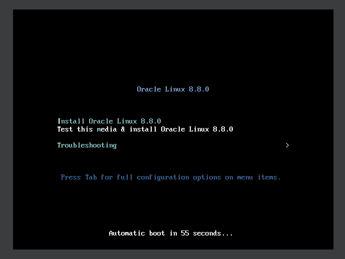

### Configurando

- Selecione o Idioma e **CONTINUAR**
- Depois será redirecioado para a tela de **RESUMO DE INSTALAÇÃO**, que contém diversas opções de configuração diferentes. Vamos atualizar cada um deles, especialmente as opções com marcas de alerta, antes de iniciar o processo de instalação.

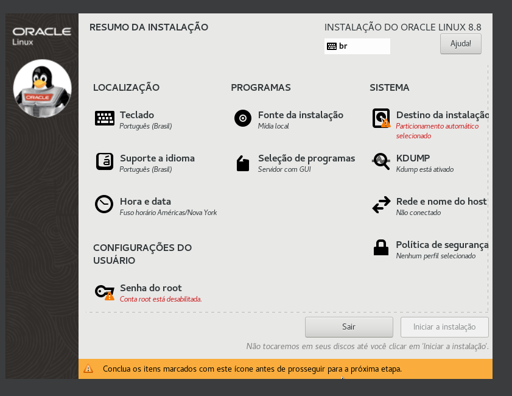

- Na Seção **SISTEMA** selecione **REDE E NOME DO HOST**, e o ligue depois clique em **PRONTO**
- Ainda na seção **SISTEMA**, selecione **DESTINO DA INSTALAÇÃO**, selecione o disco, e na seção **CONFIGURAÇÃO DE ARMAZENAMENTO**, deixe marcada a opção **AUTOMÁTICA**
- Na seção **SISTEMA** selecione **KDUMP**, e selecione a opção **ATIVAR KDUMP**, e pronto.
- A opção mais importante na seção **PROGRAMA** é a opção **FONTE DE INSTALAÇÃO**, clique nessa opção e selecione a opção **MÍDIA DE INSTALAÇÃO DETECTADA AUTOMATICAMENTE**. Depois disso, clique no botão **VERIFICAR**.
- Abra a opção **Seleção de programas** na seção **Programas**
- Selecione a opção **MINIMAL INSTALL**, e selecione a opção **FERRAMENTAS DE DESENVOLVIMENTO** ou **Development tools** no menu a direita, por fim clique em pronto, está opção instalará uma versão sem **_Interface Gráfica_**.

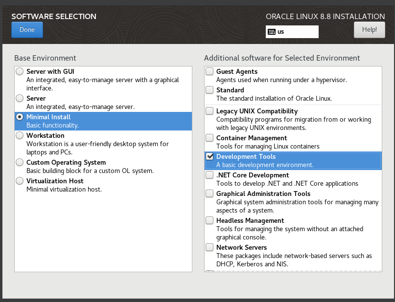

8.  Agora, na Seção **CONFIGURAÇÕES DO USUARIO**, selecione a opção **SENHA ROOT**, e coloque uma senha, depois clique em **PRONTO**.
9.  Depois de atualizar todas essas informações pode dar inicio a instalação do Software, no botão **INICIAR A INSTALAÇÃO** e aguarde a instalação ser feita.
10. Quando finalizado a instalção clique em **REINICIAR O SISTEMA**.

## Configurar IP Fixo

### Depois de iniciar a máquina faça login com seu usuário e senha e se localize

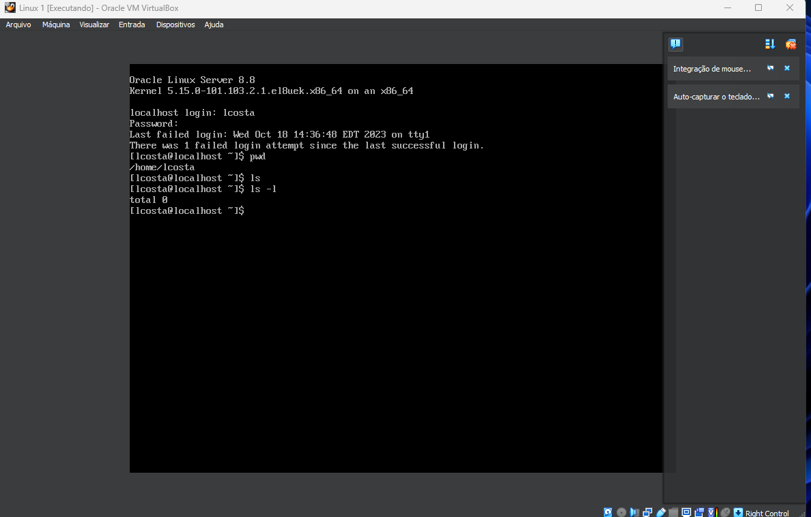

**Primeiro é importante verificar o IP que a máquina está utilizando**

- Use o comando

```
 ip address
```

- Isso irá retorna algo como:

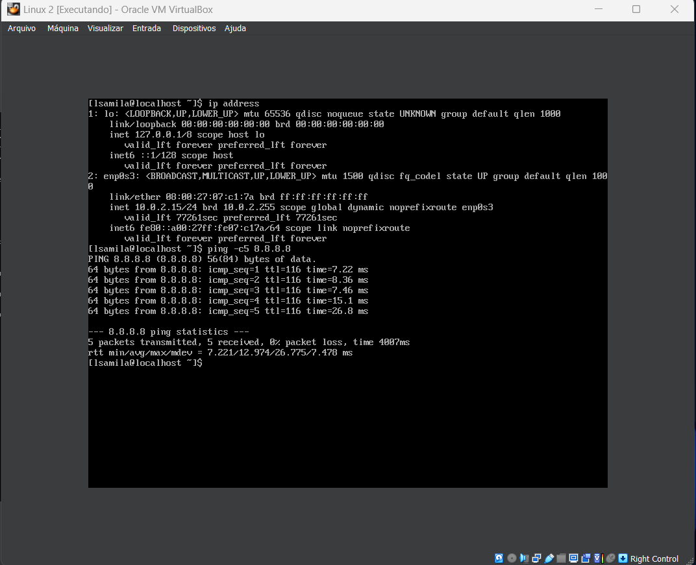

- Depois teste a rede usando o comando:

**_O -c5 foi usado para enviar apenas cinco pacotes de ping_**

```
ping -c5 8.8.8.8
```

### Precisamos editar o arquivo de configuração da interface de rede

- Primeiro vamos buscar o nome desse arquivo:

_Use o comando:_

```
ls /etc/sysconfig/network-scripts/
```

- Agora que sabemos o nome do arquivo vamos edita-lo:

_Use o comando, para entrar no modo de edição do vim (Pode ser pedido a sua senha de usuário):_

```
sudo vi /etc/sysconfig/network-scripts/ifcfg-NOME_DA_SUA_INTERFACE
```

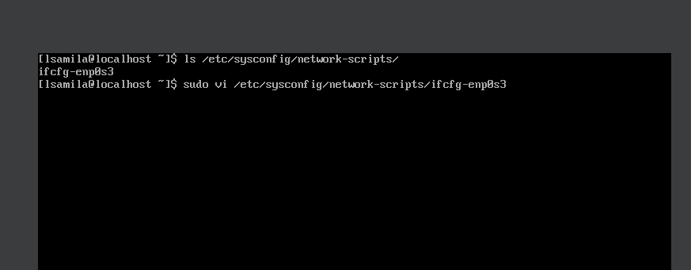

- Quando estiver dentro do arquivo aperte **I** para entrar no modo **INSERT**

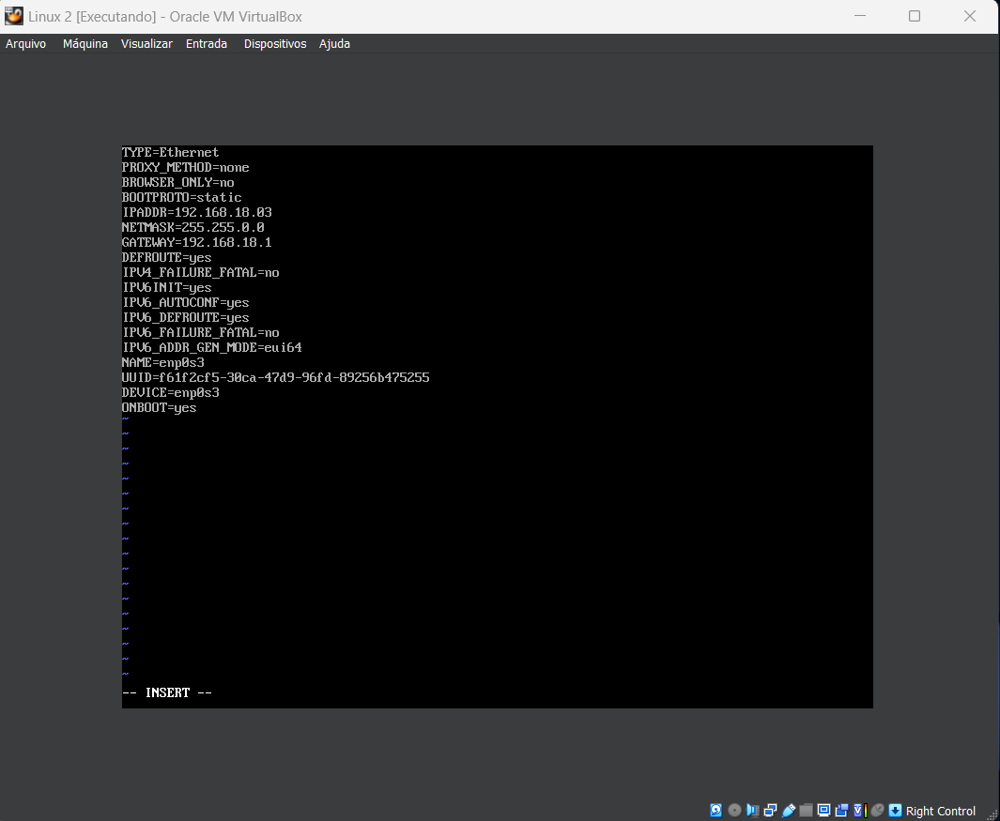

- Edite o seu arquivo com as novas informações:

```
BOOTPROTO=static
IPADDR=SEU_IP
NETMASK=SUA_MASCARA
GATEWAY=SEU_GATEWAY
```

- Depois de editar, _Aperte Esc (para entrar no modo comando), e use o comando para sair e salvar:_

```
:wq
```

- Reinicie o serviço de rede para aplicar as alterações _(Pode ser pedido a senha)_:

```
sudo systemctl restart NetworkManager
```

- Verifique se as novas informações foram atualizadas:

_Use o comando:_

```
ip address
```

- Voce pode verificar que o endereço IP foi atualizado em **_Inet_**

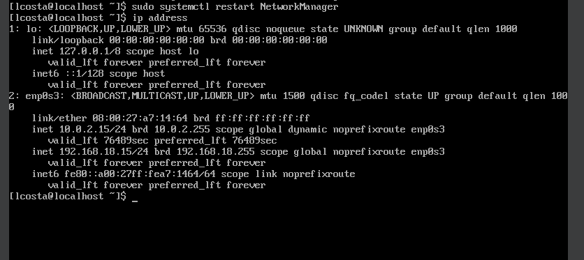

## Servidor NFS

### Na VM 1 (Servidor NFS):

1. Instale o servidor NFS se ele ainda não estiver instalado:

```
sudo dnf install -y nfs-utils
```

2. Depois de instalado crie uma pasta compartilhada:

```
sudo mkdir /nfs-share
```

- Crie alguns arquivos teste

```
sudo fallocate -l 10MB /nfs-share/file1
echo "This is a shared text file." | sudo tee /nfs-share/shared-text.txt > /dev/null
```

- Verifique se os arquivos foram criados com sucesso.

```
ls -lh /nfs-share
```

3. É importante configurar as permissões da pasta, exemplo:

```
sudo chmod -R 777 /nfs-share
```

### Editando o arquivo /etc/exports

1. Para editar o arquivo:

```
echo "/nfs-share  <CLIENTE_IP>(rw)" | sudo tee -a /etc/exports > /dev/null
```

_Substitua <CLIENTE_IP> pelo endereço IP da sua segunda VM._

### Reinicie o Servidor

1. Depois de aplicar alterações é necessário que reinicie o seu servidor:

```
sudo systemctl restart nfs-server
```

### Iniciar o Servidor NFS

1. Defina o firewall para permitir tráfego NFS.

```
sudo firewall-cmd --permanent --zone=public --add-service=nfs
sudo firewall-cmd --reload
sudo firewall-cmd --list-all
```

2. Para ativar e iniciar o serviço NFS.

```
sudo systemctl enable --now nfs-server
showmount -e
```

## Cliente

### Na VM 2 (Cliente NFS):

1. Primeiro instale o cliente NFS:

```
sudo dnf install -y nfs-utils
```

2. Crie um diretório para montar a pasta compartilhada do servidor.

   _Montar uma pasta significa torná-la acessível e disponível para leitura e gravação._

```
sudo mount <SERVER_IP>:/nfs-share /nfs-mount
```

- _Substitua <Server_IP> pelo o endereço IP da sua primeira VM_
- Obtenha uma lista de diretorios:

```
ls -lh /nfs-mount
```

3. Teste o acesso ao compartilhamento NFS:

```
echo "Hello World!" >> /nfs-mount/shared-text.txt
cat /nfs-mount/shared-text.txt
```

### Resultado VM 2:

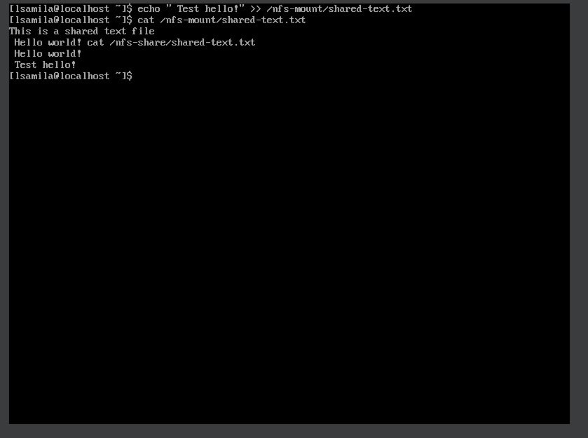

### Resultado VM 1:

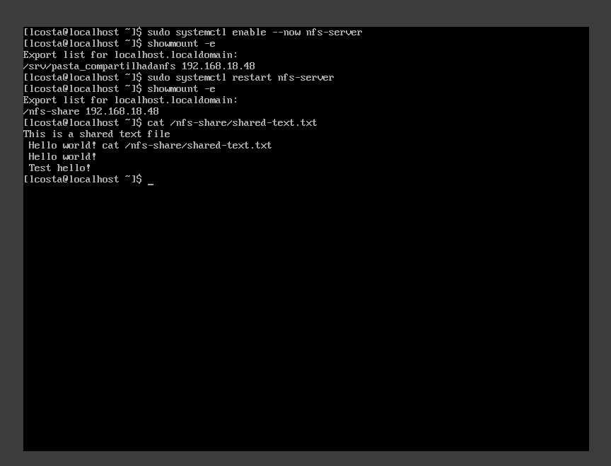
